# MRIIQ — MRI Prior Authorization Intelligence System

> **DISCLAIMER:** **SYNTHETIC-DATA DEMO ONLY.** No real Protected Health Information (PHI) or real patient records are used at any stage. All clinical notes, patient demographics, and documents are entirely synthetic.

---

## 📌 Executive Overview
 
**MRIIQ** ([mriiq.fit](https://mriiq.fit)) is an enterprise-grade, full-stack Prior Authorization Intelligence platform designed for Lumbar Spine MRI evaluation. It coordinates **agentic AI orchestration**, **the Model Context Protocol (MCP)**, **OpenAI `gpt-5.6-terra`**, **deterministic clinical decision rules**, **SOAP-formatted physician documentation**, **grounded clinical RAG**, and **human-in-the-loop (HITL) review**.

The core design principle is:
> **The LLM never makes the authorization decision.**  
> OpenAI `gpt-5.6-terra` is used strictly for natural-language clinical fact extraction and grounded RAG document queries. A deterministic, auditable Python rule engine evaluates medical necessity criteria, and a licensed human reviewer makes the final determination.

---

## 🛠 Technology Stack

| Layer | Technologies & Libraries |
|---|---|
| **Frontend** | [Next.js](https://nextjs.org/) 16 (App Router, Turbopack), [React](https://react.dev/) 19, TypeScript, Vanilla CSS Design System |
| **Backend API** | [Python](https://www.python.org/) 3.14, [FastAPI](https://fastapi.tiangolo.com/), Uvicorn, Pydantic v2 |
| **Agentic AI Orchestrator** | [LangGraph](https://langchain-ai.github.io/langgraph/) StateGraph with `MemorySaver` checkpointer & `interrupt_before` |
| **AI Provider** | **OpenAI exclusively** — Extraction & RAG: `gpt-5.6-terra`, Structured Outputs via `max_completion_tokens`, TTS: `tts-1-hd` / `onyx` |
| **Tool Protocol** | **Model Context Protocol (MCP)** Python SDK v2.x (`mcp`), FastMCP Server |
| **Speech Engine** | **Universal TTS Engine** — OpenAI `tts-1-hd` with automatic seamless Web Speech API (`window.speechSynthesis`) fallback |
| **Cloud & Hosting** | **Firebase App Hosting** (`quantiq221` / `mriiq` / `us-east4`), Google Cloud, custom domain `mriiq.fit` |
| **Document Generation** | [ReportLab](https://www.reportlab.com/) synthetic clinical PDF generator (Formal SOAP Notes format) |

---

## 🧠 LangGraph StateGraph Architecture

All LangGraph workflows, state definitions, nodes, edges, and agentic integrations are written in **pure Python** under [`backend/app/graph/`](backend/app/graph/).

```mermaid
flowchart TD
    START([START]) --> fetch_patient["Node 1: fetch_patient\n(MCP Tool Agent)"]
    fetch_patient --> extract["Node 2: extract\n(Clinical Reader Agent gpt-5.6-terra)"]
    extract --> decide["Node 3: decide\n(Policy Decision Engine)"]
    decide --> rag_assistant["Node 4: rag_assistant\n(SOAP Clinical RAG Agent)"]
    rag_assistant --> PAUSE{{"⏸ interrupt_before\n(HITL Checkpoint MemorySaver)"}}
    
    PAUSE -.->|Reviewer Decision Submitted| apply_review["Node 5: apply_review\n(Audit Finalization)"]
    apply_review --> END_NODE([END])

    classDef hitl fill:#1e293b,stroke:#f59e0b,stroke-width:2px;
    class PAUSE hitl;
```



### 1. LangGraph State (`AuthState`) in Python
Located in [`backend/app/graph/state.py`](backend/app/graph/state.py):

```python
class AuthState(BaseModel):
    """Shared mutable state threaded through every LangGraph node."""
    # ── Workflow Inputs ──
    patient_id: str = ""             # "P001", "P002", "P003"
    clinical_note: str = ""          # Raw physician clinical narrative

    # ── MCP Tool Data ──
    patient: dict = {}               # Plan status & member details from MCP
    rule: dict = {}                  # Payer policy rules (min 6w pain, min 6w physio)

    # ── OpenAI Fact Extraction (gpt-5.6-terra) ──
    pain_weeks: Optional[float] = None     # Extracted pain duration
    physio_weeks: Optional[float] = None   # Extracted supervised physio weeks
    extraction_raw: str = ""               # Serialized Pydantic extraction model

    # ── Deterministic Authorization Decision ──
    recommendation: str = ""         # "APPROVE" | "DENY"
    denial_reasons: list[str] = []   # Missing criteria checklist

    # ── Agentic Clinical RAG Q&A (SOAP Notes) ──
    rag_query: Optional[str] = None
    rag_answer: Optional[str] = None
    rag_cited_section: Optional[str] = None  # "Subjective" | "Objective" | "Assessment" | "Plan"
    rag_evidence: List[str] = []

    # ── Human-in-the-Loop Review (HITL) ──
    human_decision: str = ""         # "approved" | "rejected"
    final_outcome: str = ""          # Audit trial recorded outcome

    # ── System Errors ──
    error: str = ""
```

### 2. LangGraph Nodes & Edges in Python
Located in [`backend/app/graph/workflow.py`](backend/app/graph/workflow.py) and [`backend/app/graph/nodes.py`](backend/app/graph/nodes.py):

| Node | Python Function | Role | Transitions To |
|---|---|---|---|
| **`fetch_patient`** | `node_fetch_patient` | Invokes the MCP Tool Agent to retrieve active coverage eligibility and clinical guideline rules. | `extract` |
| **`extract`** | `node_extract` | Invokes the Clinical Reader Agent (`gpt-5.6-terra`) with strict prompts to extract numerical durations without inference. | `decide` |
| **`decide`** | `node_decide` | Executes deterministic medical criteria validation (`plan_active`, `pain_weeks >= 6`, `physio_weeks >= 6`). | `rag_assistant` |
| **`rag_assistant`** | `node_rag_assistant` | Grounded clinical RAG agent answering queries over the patient's SOAP documentation. | `apply_review` |
| ⏸ **INTERRUPT** | `interrupt_before=["apply_review"]` | Halts execution. State snapshot is saved in `MemorySaver` keyed by `thread_id`. Frontend renders review card. | — |
| **`apply_review`** | `node_apply_review` | Resumes from checkpoint with human reviewer's confirmation or override, producing the final recorded audit trail. | `END` |

---

## 🤖 The Suite of Agentic AI Agents in Python

All AI agents are implemented in Python in [`backend/app/agents/`](backend/app/agents/):

```text
backend/app/agents/
├── reader.py     # Clinical Reader Agent (gpt-5.6-terra fact extraction)
├── decision.py   # Deterministic Decision Agent (evidence-based criteria engine)
├── rag.py        # Clinical RAG Agent (SOAP EHR Q&A with section citations)
├── vision.py     # Multimodal Vision Agent (chart scan & document analysis)
└── tts.py        # Voice Briefing Agent (OpenAI tts-1-hd, onyx)
```

### 1. Clinical Reader Agent ([reader.py](backend/app/agents/reader.py))
- Uses **OpenAI `gpt-5.6-terra`** with modern `max_completion_tokens` parameter.
- Enforces strict zero-hallucination rules:
  - Extracts only explicitly written durations in weeks.
  - "No physiotherapy was tried" ➔ `physio_weeks = 0`.
  - Physiotherapy mentioned without duration ➔ `physio_weeks = null`.
  - Absent mention ➔ `physio_weeks = null`.

### 2. Deterministic Decision Agent ([decision.py](backend/app/agents/decision.py))
- Evaluates clinical necessity criteria:
  1. Is the insurance policy active? (`plan_active == True`)
  2. Has pain persisted for at least 6 weeks? (`pain_weeks >= 6`)
  3. Has a supervised physical therapy trial been completed for at least 6 weeks? (`physio_weeks >= 6`)
- Output: `APPROVE` or `DENY` with precise itemized denial justifications.

### 3. Clinical RAG Agent ([rag.py](backend/app/agents/rag.py))
- Ingests synthetic physician documentation in full **SOAP (Subjective, Objective, Assessment, Plan)** format.
- Queries `gpt-5.6-terra` with prompt constraints forcing answers to cite specific SOAP sections (`[Subjective]`, `[Objective]`, `[Assessment]`, `[Plan]`).
- Includes a built-in deterministic clinical semantic retrieval engine as a resilient fallback if an API key is missing or network fails.

### 4. Multimodal Vision Agent ([vision.py](backend/app/agents/vision.py))
- Employs `gpt-5.6-terra` vision capabilities to parse clinical charts, handwritten notes, and scanned documents.

### 5. TTS Voice Briefing Agent ([tts.py](backend/app/agents/tts.py))
- Synthesizes MP3 voice briefs of prior authorization verdicts via OpenAI `tts-1-hd` using the `onyx` voice.

### 6. MCP Client & Tool Agent ([backend/app/mcp/client.py](backend/app/mcp/client.py))
- Connects to the FastMCP server ([mcp_server/server.py](mcp_server/server.py)) implementing the Model Context Protocol to query patient records (`get_patient`) and policy thresholds (`get_rule`).

---

## 📋 SOAP Notes Clinical Documentation & Grounded RAG

All synthetic patient cases (**P001**, **P002**, **P003**) are modeled in the medical industry standard **SOAP (Subjective, Objective, Assessment, Plan)** format:

- **`[S] Subjective`**: Chief complaint, history of present illness (HPI), pain duration in weeks, VAS pain rating (1–10), and functional impact on activities of daily living.
- **`[O] Objective`**: Vitals, physical examination (gait, lumbar ROM), neurological examination (motor, dermatomes, reflexes), Straight Leg Raise (SLR) test, and supervised physical therapy duration.
- **`[A] Assessment`**: Diagnoses with ICD-10 codes, medical necessity criteria checklist (Active Plan, Pain ≥ 6w, Physio ≥ 6w), and prior authorization determination (`APPROVE` or `DENY`).
- **`[P] Plan`**: Requested procedure (`CPT 72148` Lumbar Spine MRI without contrast), clinical orders, pharmacotherapy, and follow-up plan.

### Official Generated SOAP PDFs
Professional clinical PDFs are generated using ReportLab and downloadable directly from the app:
- [`public/mock-pdfs/P001.pdf`](public/mock-pdfs/P001.pdf) — *Alex Morgan (Approved: 10w pain, 8w physio, active plan)*
- [`public/mock-pdfs/P002.pdf`](public/mock-pdfs/P002.pdf) — *Jordan Lee (Denied: 9w pain, 0w physio)*
- [`public/mock-pdfs/P003.pdf`](public/mock-pdfs/P003.pdf) — *Casey Kim (Denied: 12w pain, 0w physio, inactive coverage)*

---

## 🔊 Universal Speech Engine (Zero 503 Errors)

To eliminate runtime audio failures (such as `503 Service Unavailable` when server keys are not configured in cloud containers), the frontend implements a **Universal Speech Engine** ([src/lib/speech.ts](src/lib/speech.ts)):

1. **Server Attempt**: First calls `/api/tts` with the clinical script to request high-fidelity OpenAI `tts-1-hd` (`onyx`) audio.
2. **Resilient Fallback**: If the server returns 503 or fails, the engine seamlessly and transparently falls back to the browser's native **Web Speech API (`window.speechSynthesis`)**.
3. **Audio Controls Everywhere**:
   - **Clinical Notes Area**: "🔊 Listen to Note" / "⏹ Stop" button in [ClinicalNote.tsx](src/components/ClinicalNote.tsx).
   - **Clinical Summary Area**: "🔊 Listen to Summary" / "⏹ Stop" button in [RecommendationCard.tsx](src/components/RecommendationCard.tsx).
   - **RAG Answers**: "🔊 Listen" / "⏹ Stop" button on every RAG query response in [SOAPRagChat.tsx](src/components/SOAPRagChat.tsx).

---

## 📋 Benchmark Synthetic Test Cases

| Patient ID | Name | Insurance Plan | Pain Duration | Supervised Physio | Determination | Rationale |
|---|---|---|---|---|---|---|
| **`P001`** | Alex Morgan | Horizon Blue Cross (Active) | 10 weeks | 8 weeks | **APPROVE** | All medical necessity criteria satisfied. |
| **`P002`** | Jordan Lee | Aetna Choice POS (Active) | 9 weeks | 0 weeks | **DENY** | Failed prerequisite 6-week physiotherapy trial. |
| **`P003`** | Casey Kim | UnitedHealthcare (Terminated) | 12 weeks | 0 weeks | **DENY** | Inactive coverage policy & no physiotherapy trial. |

---

## 🌐 Custom Domain & Deployment ([mriiq.fit](https://mriiq.fit))

MRIIQ is live on **Firebase App Hosting** in Google Cloud region `us-east4`:

| Domain | Destination |
|---|---|
| **`https://mriiq.fit`** | Production Web Application |
| **`https://www.mriiq.fit`** | Canonical Redirect |
| **`https://mriiq--quantiq221.us-east4.hosted.app`** | Firebase App Hosting Backend |
| **`https://api.mriiq.fit`** | Backend API (or relative `/api/*`) |

### Automated Rollouts:
Firebase App Hosting monitors the GitHub repository [`iChancetek/MRIIQ`](https://github.com/iChancetek/MRIIQ). Pushing to the `main` branch triggers automated container builds and zero-downtime rollouts.

---

## 🚀 Quick Start Guide

### Step 1: Clone & Configure Environment
```bash
git clone https://github.com/iChancetek/MRIIQ.git
cd MRIIQ

# Configure .env:
OPENAI_API_KEY="your-openai-api-key"
OPENAI_MODEL=gpt-5.6-terra
OPENAI_TTS_MODEL=tts-1-hd
OPENAI_TTS_VOICE=onyx
```

### Step 2: Run Python Automated Tests
```bash
python -m pip install -r backend/requirements.txt
python test.py
```

Expected output:
```text
P001: PASS  ->  Decision approved by reviewer - Recommendation: APPROVE
P002: PASS  ->  Decision approved by reviewer - Recommendation: DENY
P003: PASS  ->  Decision approved by reviewer - Recommendation: DENY
P001-REJECT: PASS  ->  Decision rejected by reviewer

--- Testing Python RAG Agent (SOAP Notes) ---
RAG [P001] 'What are the straight leg raise findings?' -> [Objective]: PASS
RAG [P001] 'Did the patient complete physiotherapy?' -> [Objective]: PASS
RAG [P002] 'How many weeks of physical therapy was attempted?' -> [Objective]: PASS
RAG [P003] 'What is the health insurance coverage status?' -> [Assessment]: PASS

All tests PASSED.
```

### Step 3: Launch Local Servers
```bash
# Terminal 1: FastAPI Backend
uvicorn backend.app.main:app --reload --port 8000

# Terminal 2: Next.js Frontend
cd frontend
npm install
npm run dev
```

Navigate to [http://localhost:3000](http://localhost:3000) or [http://mriiq.fit:3000](http://mriiq.fit:3000).

---

## 🔒 Security & Compliance Safeguards

1. **Zero PHI**: Strictly operates on synthetic, non-identifiable benchmark data.
2. **Server-Side API Key Protection**: `OPENAI_API_KEY` is exclusively handled in server-side runtimes and never packaged in client bundles.
3. **Deterministic Authority**: AI extractions are strictly evaluated against rigid medical criteria; no generative model can issue an unvalidated authorization approval.
4. **Human Oversight (HITL)**: Prior authorization decisions require human clinical reviewer approval with full immutable audit logging.
